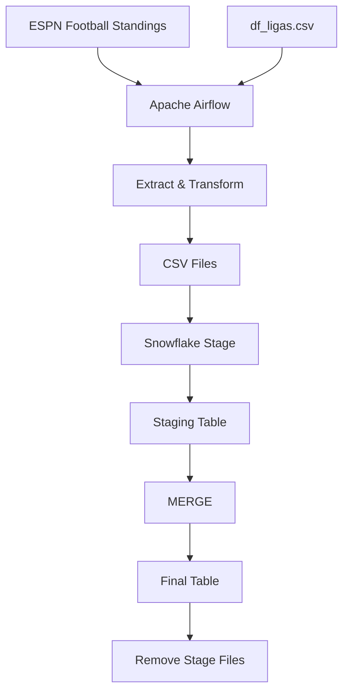

# Football Data Pipeline

## Overview

End-to-end data pipeline for extracting football league standings from ESPN, transforming the data, and loading it into Snowflake using Apache Airflow.

The pipeline currently processes the following seven leagues:

- Spain
- England
- Italy
- Germany
- France
- Portugal
- Netherlands

The project was built as a practical Data Engineering project, focusing on orchestration, data extraction, transformation, staging, incremental loading, and testing.

---

## Architecture



---

## Technologies

- **Python**
- **Apache Airflow**
- **Astronomer Astro CLI**
- **Docker**
- **Pandas**
- **Snowflake**
- **SQL**
- **Pytest**
- **Jupyter Notebook**

---

## Data Source

The pipeline extracts football standings from ESPN's football league pages using `pandas.read_html()`.

The source configuration is stored in `df_ligas.csv`:

```csv
LIGA,URL
ESPAÑA,https://www.espn.com.co/futbol/posiciones/_/liga/esp.1
INGLATERRA,https://www.espn.com.co/futbol/posiciones/_/liga/eng.1
ITALIA,https://www.espn.com.co/futbol/posiciones/_/liga/ita.1
ALEMANIA,https://www.espn.com.co/futbol/posiciones/_/liga/ger.1
FRANCIA,https://www.espn.com.co/futbol/posiciones/_/liga/fra.1
PORTUGAL,https://www.espn.com.co/futbol/posiciones/_/liga/por.1
HOLANDA,https://www.espn.com.co/futbol/posiciones/_/liga/ned.1
```

The extracted data includes:

- Team
- Matches played
- Wins
- Draws
- Losses
- Goals for
- Goals against
- Goal difference
- Points
- League
- Creation date

---

## Pipeline

The Airflow DAG is composed of the following tasks:

```text
update_team_table
        ↓
extract_league
        ↓
upload_data_stage
        ↓
truncate_staging
        ↓
ingest_table
        ↓
merge_table
        ↓
remove_stage_file
```

### 1. Update Team Table

The pipeline first builds or updates a persistent team mapping table.

Each team receives an `ID_TEAM` generated with UUIDs.

Existing IDs are preserved between executions, allowing the same team to maintain a stable identifier across pipeline runs.

This is particularly important because ESPN's raw team names are not always clean or consistent.

Examples of raw values encountered include:

```text
1ESPEspanyol
2ALAAlavés
M05Mainz
S04Schalke 04
FCU1. FC Union Berlin
```

The project includes a cleaning function to normalize these values before they are used in the final dataset.

---

### 2. Extract League Data

The `extract_league` task extracts the standings for each configured league.

Airflow's **Dynamic Task Mapping** is used so that the extraction task is dynamically created for every league in `df_ligas.csv`.

Conceptually:

```text
extract_league[0] → Spain
extract_league[1] → England
extract_league[2] → Italy
...
```

A random delay between 1 and 3 seconds is applied before each request to avoid sending requests simultaneously.

Each extracted dataset is stored as a timestamped CSV file.

Example:

```text
football_positions_20260817T070000_españa.csv
```

---

### 3. Upload to Snowflake Stage

The generated CSV files are uploaded to a Snowflake internal stage using the `PUT` command.

Files are automatically compressed by Snowflake.

---

### 4. Staging Table

Before loading new data, the staging table is truncated.

The CSV files are then loaded into:

```text
LEAGUES.PUBLIC.FOOTBALL_LEAGUES_STAGING
```

The staging layer provides an intermediate step between raw extracted data and the final table.

---

### 5. Merge into Final Table

The staging data is merged into:

```text
LEAGUES.PUBLIC.FOOTBALL_LEAGUES
```

The `MERGE` operation uses `ID_TEAM` as the matching key.

Existing teams are updated, while new teams are inserted.

This provides an incremental loading strategy instead of simply replacing the entire final dataset.

---

### 6. Remove Stage Files

After successful ingestion, the processed files are removed from the Snowflake stage.

This prevents previously processed files from accumulating.

---

## Airflow DAG

The DAG is defined in:

```text
dags/football_leagues/football_leagues.py
```

### Schedule

The pipeline is scheduled to run:

```text
Every Monday and Thursday at 07:00
```

The DAG uses the `America/Bogota` timezone.

```python
schedule="0 7 * * 1,4"
```

Catchup is disabled:

```python
catchup=False
```

### Retry Policy

Tasks use the following default retry configuration:

```text
Retries: 1
Retry delay: 5 minutes
```

---

## Snowflake

The project uses the following Snowflake objects:

| Object | Name |
|---|---|
| Database | `LEAGUES` |
| Schema | `PUBLIC` |
| Warehouse | `normal_wh` |
| Stage | `DEMO_STAGE` |
| Staging table | `FOOTBALL_LEAGUES_STAGING` |
| Final table | `FOOTBALL_LEAGUES` |

The Snowflake connection is configured in Airflow using:

```text
snowflake_connection
```
---

## Snowflake Setup

The Snowflake environment was initialized with the following components:

- **Warehouse:** `normal_wh` (XSMALL)
- **Database:** `LEAGUES`
- **Schema:** `PUBLIC`
- **Stage:** `DEMO_STAGE`
- **Staging table:** `FOOTBALL_LEAGUES_STAGING`
- **Final table:** `FOOTBALL_LEAGUES`

The initial Snowflake setup includes the creation of the warehouse, database, internal stage, and target table.

### Warehouse and Database

```sql
CREATE OR REPLACE WAREHOUSE normal_wh
WAREHOUSE_SIZE = XSMALL
INITIALLY_SUSPENDED = TRUE;

CREATE DATABASE LEAGUES;

USE WAREHOUSE normal_wh;
USE DATABASE LEAGUES;
USE SCHEMA PUBLIC;
```

### Stage

An internal Snowflake stage is used as an intermediate storage location for the extracted CSV files.

```sql
CREATE STAGE demo_stage;
```

### Final Table

The final table stores the normalized football standings:

```sql
CREATE OR REPLACE TABLE football_leagues (
    ID_TEAM          VARCHAR(30) NOT NULL,
    EQUIPO           VARCHAR(30) NOT NULL,
    JUGADOS          INTEGER NOT NULL,
    GANADOS          INTEGER NOT NULL,
    EMPATADOS        INTEGER NOT NULL,
    PERDIDOS         INTEGER NOT NULL,
    GOLES_A_FAVOR    INTEGER NOT NULL,
    GOLES_EN_CONTRA  INTEGER NOT NULL,
    DIFERENCIA       INTEGER NOT NULL,
    PUNTOS           INTEGER NOT NULL,
    LIGA             VARCHAR(30) NOT NULL,
    CREATED_AT       VARCHAR(30) NOT NULL
);
```

The pipeline uses a separate staging table to temporarily hold the extracted data before it is merged into the final table.

### Validation Queries

Basic queries were used during development to validate the loaded data and inspect the Snowflake stage:

```sql
SELECT *
FROM football_leagues
WHERE LIGA = 'ALEMANIA';

SELECT DISTINCT LIGA
FROM football_leagues;

LIST @demo_stage;
```

### Pipeline SQL

The SQL queries used during pipeline execution are located in:

```text
dags/football_leagues/queries/
```

They handle:

- Uploading extracted files to the Snowflake stage
- Loading data into the staging table
- Truncating staging data
- Merging records into the final table
- Removing processed files from the stage

This separation between the initial Snowflake setup and the SQL executed by the Airflow DAG keeps the warehouse provisioning and pipeline processing responsibilities distinct.

---

## Configuration

The DAG retrieves Snowflake-related configuration from an Airflow Variable named:

```text
feature_info
```

The variable contains configuration such as:

```json
{
  "stage": "demo_stage",
  "table": "football_leagues",
  "DWH": "normal_wh",
  "DB": "LEAGUES",
  "ROLE": "ACCOUNTADMIN"
}
```

The pipeline uses these values to configure the Snowflake operations.

> **Note:** `ACCOUNTADMIN` is used in the development environment. In a production environment, a role with only the permissions required by the pipeline should be preferred.

---

## Local Setup

### Prerequisites

Make sure the following tools are installed:

- Docker
- Astronomer Astro CLI
- Git

### Clone the repository

```bash
git clone https://github.com/IngDavidHoyosGil/football-pipeline.git
cd football-pipeline
```

### Start Airflow

Initialize the Astro project if required:

```bash
astro dev init
```

Then start the local Airflow environment:

```bash
astro dev start
```

Once the containers are running, Airflow can be accessed through the local Airflow web interface.

---

## Airflow Configuration

Create the following Airflow resources:

### Connection

Create a Snowflake connection with:

```text
Connection ID: snowflake_connection
```

The connection should contain the credentials and connection parameters required to access the Snowflake account.

### Variable

Create an Airflow Variable named:

```text
feature_info
```

with the Snowflake configuration required by the DAG.

Credentials and secrets should not be committed to the repository.

---

## Testing

The project includes automated tests using `pytest`.

The test suite covers:

- DAG import
- DAG structure
- Task dependencies
- DAG schedule
- Team name cleaning
- League configuration
- Data extraction
- Team table generation
- League extraction task
- SQL merge logic
- Snowflake stage upload
- Staging table truncation
- Table ingestion
- Stage file cleanup

Run the tests with:

```bash
pytest tests/
```

Current test result:

```text
14 passed
```

The tests use mocks where appropriate to avoid making real external requests or writing production data during testing.

---

## Challenge

One of the main challenges of the project was dealing with inconsistent team names returned by ESPN.

The source data may contain:

```text
1ESPEspanyol
2ALAAlavés
M05Mainz
S04Schalke 04
FCU1. FC Union Berlin
```

These values cannot be reliably used directly as team identifiers.

A normalization process was therefore implemented to clean the team names before joining the extracted standings with the persistent team mapping.

Another challenge was maintaining stable team identifiers between pipeline executions.

To solve this, the pipeline:

1. Loads the existing team mapping when available.
2. Preserves existing `ID_TEAM` values.
3. Generates IDs only for new teams.
4. Saves the updated mapping for future executions.

---

## Technical Decisions

### Persistent Team IDs

Team IDs are generated independently from the source website.

This prevents changes in the source formatting from affecting the team's identifier.

### Staging Layer

A dedicated Snowflake staging table is used before loading the final table.

This separates ingestion from the final dataset and makes the pipeline easier to extend with additional validation or transformations.

### MERGE Strategy

The final table is updated using Snowflake `MERGE`.

This allows the pipeline to:

- Update existing teams.
- Insert new teams.
- Avoid blindly replacing the entire final table.

### Dynamic Task Mapping

Airflow Dynamic Task Mapping allows the same extraction logic to be executed independently for each configured league.

Adding another league therefore only requires adding its URL and name to `df_ligas.csv`.

### External League Configuration

League URLs are kept outside the DAG code.

This makes the pipeline easier to maintain and extend without modifying the orchestration logic.

---

## Future Improvements

Potential improvements include:

### Data Quality

- Add validation for unexpected or missing columns.
- Validate numerical ranges.
- Detect duplicate teams.
- Add data quality checks before loading the final table.

### Reliability

- Add more granular retry strategies.
- Implement better handling of source website changes.
- Add monitoring and alerting.

### Data Warehouse

- Introduce separate dimension and fact tables.
- Add historical standings.
- Improve data lineage.
- Implement additional Snowflake data quality controls.

### Infrastructure

- Deploy the Airflow environment to a cloud platform.
- Use infrastructure as code.
- Separate development and production environments.
- Implement CI/CD.

### Analytics

The final dataset could be used to build dashboards for:

- League standings
- Team performance
- Points progression
- Goals scored/conceded
- Historical league performance

---

## Project Structure

```text
.
├── dags/
│   └── football_leagues/
│       ├── football_leagues.py
│       └── queries/
│           ├── merge_table.sql
│           ├── remove_stage_file.sql
│           ├── truncate_staging.sql
│           ├── upload_stage.sql
│           └── upload_table.sql
├── notebooks/
│   └── football_data_exploration.ipynb
├── tests/
│   └── dags/
│       └── test_football_leagues.py
├── df_ligas.csv
├── requirements.txt
├── Dockerfile
├── packages.txt
└── README.md
```

---

## License

This project is intended for educational and portfolio purposes.